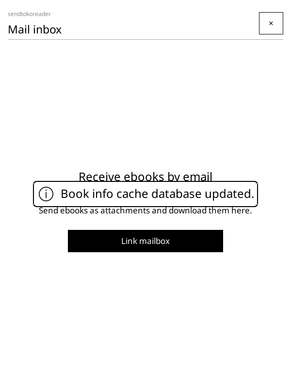
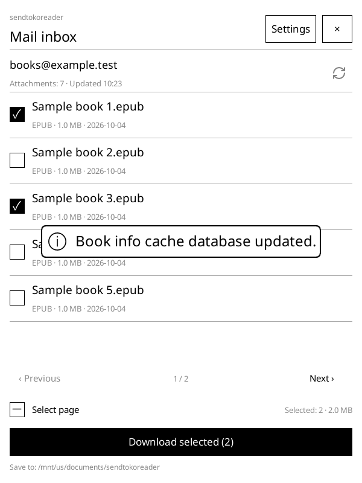
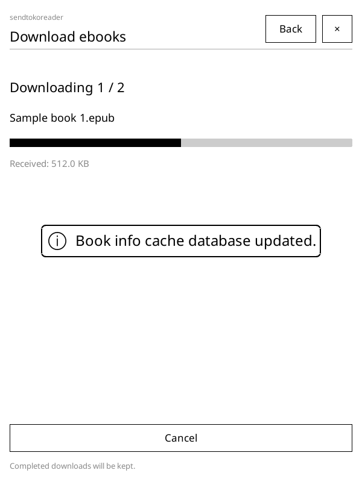

# sendtokoreader

[Chinese documentation](README_CN.md)

[](https://github.com/finlater/sendtokoreader.koplugin/actions/workflows/ci.yml)
[](https://github.com/finlater/sendtokoreader.koplugin/releases)
[](LICENSE)

A KOReader plugin for receiving ebooks through your own email account. Send a book as a regular attachment, refresh the inbox on your reader, and download it for reading.

## Features

- **Your own mailbox** — iCloud, Gmail, Yahoo, AOL, 163, 126, QQ and other IMAP over TLS accounts; no relay service required.
- **Localized interface** — Follows KOReader’s language setting, with complete English and Simplified Chinese interfaces, help and errors. Other languages fall back to English.
- **Simple setup** — A focused account setup screen before connecting your first mailbox.
- **Manual refresh** — Scans the last 30 days on first use, including read messages, then checks new message UIDs.
- **Multiple selection** — Select individual attachments or the current page, with a size summary and pagination only when needed.
- **Background downloads** — Shows progress, supports cancellation and retries failed attachments.
- **Preserves your mail** — Uses read-only IMAP commands and leaves messages and their read state unchanged.
- **Safe local storage** — Skips downloaded attachments that still exist; adds a numbered suffix for different attachments with the same filename.
- **Open and read** — Tap a downloaded attachment to open it in KOReader.

## Screenshots

These are native KOReader emulator renders with example data. The English documentation uses English screenshots; the Chinese documentation uses Chinese screenshots.

| Account setup | Attachment list | Download progress |
|:---:|:---:|:---:|
|  |  |  |

## Installation

1. Download `sendtokoreader.koplugin-vX.Y.Z.zip` from [GitHub Releases](https://github.com/finlater/sendtokoreader.koplugin/releases).
2. Extract the archive to get the `sendtokoreader.koplugin` folder.
3. Copy that folder into your KOReader plugins directory:

```text
koreader/plugins/sendtokoreader.koplugin/
```

4. Restart KOReader and open **Tools → sendtokoreader · Mail inbox**.

To install from source, clone this repository into a folder named `sendtokoreader.koplugin` inside the same plugins directory. To update, replace the plugin files and restart KOReader. Mailbox settings and download records are stored separately.

## Connect your mailbox

1. Choose a provider below and enable IMAP if required. Generate the authorization code or app password that provider requires.
2. Tap **Link mailbox**, choose a provider and enter your email address and credential.
3. For a custom provider, set the IMAP hostname and TLS port under **Server settings**.
4. Tap **Verify and save**.
5. Email an ebook to that address as a regular attachment. Return to the list, tap the refresh icon, select the attachment and tap **Download selected**.

| Provider | IMAP hostname | TLS port | Credential |
|---|---|---|---|
| iCloud | `imap.mail.me.com` | `993` | Apple app-specific password; two-factor authentication required |
| Google (Gmail) | `imap.gmail.com` | `993` | Google app password; 2-Step Verification and account eligibility required |
| Yahoo Mail | `imap.mail.yahoo.com` | `993` | Third-party app password, if available for your account |
| AOL Mail | `imap.aol.com` | `993` | Third-party app password, if available for your account |
| 163 Mail | `imap.163.com` | `993` | Client authorization code; enable IMAP/SMTP |
| 126 Mail | `imap.126.com` | `993` | Client authorization code; enable IMAP/SMTP |
| QQ Mail | `imap.qq.com` | `993` | Client authorization code; enable IMAP/SMTP |
| Other mailbox | Your provider's hostname | Usually `993` | IMAP password or app password |

Tap **How do I sign in?** for instructions specific to the selected provider. Changing providers clears the previous password. Presets configure the server; actual access still depends on your account and provider policy.

**Outlook.com and Exchange Online are not supported in this version.** They require OAuth, which is deferred; an app password is not a substitute for their required OAuth authentication. Self-hosted Exchange can use **Other mailbox** only when an administrator enables compatible IMAP over TLS with password authentication. Exchange Web Services and ActiveSync are not implemented. Gmail accounts that require OAuth or cannot generate app passwords are also not supported yet.

Official setup references: [Apple](https://support.apple.com/en-us/102525), [Google app passwords](https://support.google.com/accounts/answer/185833), [Yahoo](https://help.yahoo.com/kb/SLN4075.html), [AOL](https://help.aol.com/articles/how-do-i-use-other-email-applications-to-send-and-receive-my-aol-mail), [Microsoft authentication requirements](https://support.microsoft.com/en-gb/outlook/pop-imap-and-smtp-settings-for-outlook-com).

Only one account and the inbox folder are supported. Choose a download folder in **Settings → Download folder**. The default is a `sendtokoreader` subfolder of KOReader's download or home directory.

## Supported attachments and limits

Supported filename extensions: `epub`, `pdf`, `mobi`, `azw`, `azw3`, `fb2`, `txt`, `djvu`, `djv`, `cbz`, `cbr`. Actual reading support depends on KOReader.

- Supports Base64, quoted-printable and unencoded MIME attachments, encoded Chinese filenames, and RFC2231 filename parameters. Unsupported character sets fall back to an ASCII-safe filename.
- Does not download cloud-storage links or provider-specific oversized attachments, unpack ZIP files, convert formats, or send mail.
- Requires IMAP over TLS with password/app-password authentication. OAuth, STARTTLS, automatic polling and resuming partial downloads are not supported.
- A cancelled attachment restarts from the beginning on retry. Previously completed books are retained.
- Deduplication uses the mailbox's UIDVALIDITY, message UID and MIME part. Sending the same book again creates a new attachment; content hashes are not compared.

## Account storage

The password, app password or authorization code is stored locally, unencrypted, in `settings/sendtokoreader-account.json` under KOReader's data directory. The plugin requests `0600` permissions, but FAT storage may not enforce them. A dedicated receiving mailbox is recommended. Do not share that file; it is never part of a release package.

Download records are stored in `settings/sendtokoreader-state.json`. Switching accounts resets the attachment list and records while keeping downloaded books.

## Compatibility and development

This is an early preview. Local TLS IMAP communication and the headless macOS KOReader emulator have been tested. Real provider accounts, physical Kindle devices and manual touch interaction have not yet been verified.

CI checks translation coverage and format placeholders, runs static checks, builds a pinned KOReader emulator on Linux, exercises the TLS mailbox and both language versions of the native UI, and uploads test screenshots/en_US/logs. New versions on `main` are released only after those checks pass. `0.x` versions are marked as prereleases.

See [development and release instructions](docs/development.md) and [Changelog](CHANGELOG.md).

## License and acknowledgements

[MIT](LICENSE). The refresh icon is from [Lucide](https://github.com/lucide-icons/lucide/blob/0.468.0/icons/refresh-cw.svg) under its [ISC license](icons/LICENSE).

Built for [KOReader](https://github.com/koreader/koreader). Documentation structure follows [weread.koplugin](https://github.com/finlater/weread.koplugin) and [kindlebtcontroller.koplugin](https://github.com/finlater/kindlebtcontroller.koplugin).
