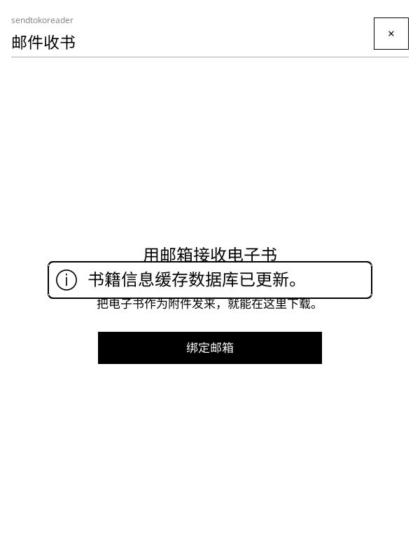
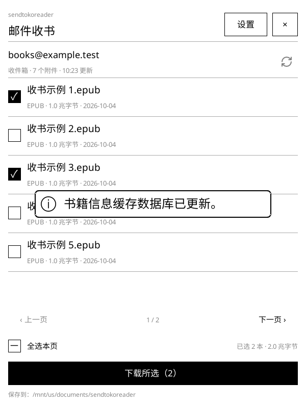
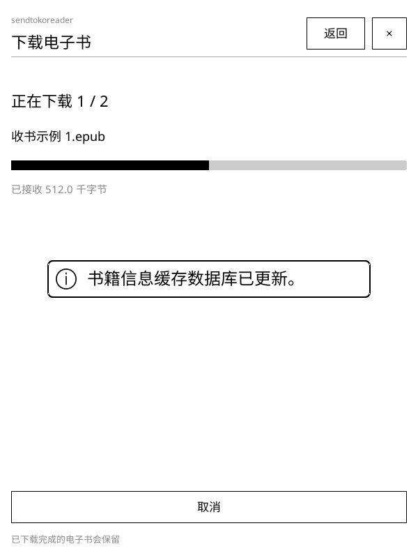

# sendtokoreader · 邮件收书

[英文文档](README.md)

[](https://github.com/finlater/sendtokoreader.koplugin/actions/workflows/ci.yml)
[](https://github.com/finlater/sendtokoreader.koplugin/releases)
[](LICENSE)

在 KOReader 中通过自己的邮箱接收电子书。将电子书作为普通附件发到邮箱，在阅读器上刷新、选择并下载，即可开始阅读。

## 功能特性

- **使用自己的邮箱**：提供苹果、谷歌、雅虎、美国在线、163、126、QQ 和其他邮箱的加密收信配置，无需中转服务。
- **简洁的绑定引导**：未绑定时只显示引导文案和「绑定邮箱」按钮。
- **手动刷新收信**：首次扫描最近 30 天的邮件，包含已读邮件；后续按邮件标识增量检查。
- **多选下载**：逐本勾选或全选本页，显示所选大小，仅多页时显示分页控件。
- **后台传输**：显示下载进度，支持取消和单独重试失败项。
- **保留原邮件**：使用只读收信命令，不删除邮件、不改变已读状态。
- **保留本地文件**：已下载且文件仍存在时跳过；不同附件同名时自动加序号，不覆盖原文件。
- **直接阅读**：点击已下载附件，使用 KOReader 打开电子书。

## 界面截图

以下为 KOReader 原生模拟器使用示例数据渲染的页面。界面、帮助和错误提示跟随阅读器语言，完整支持简体中文和英文；其他语言暂时回退为英文。

| 绑定引导 | 附件列表 | 下载进度 |
|:---:|:---:|:---:|
|  |  |  |

## 安装

1. 前往 [版本下载页](https://github.com/finlater/sendtokoreader.koplugin/releases)，下载 `sendtokoreader.koplugin-vX.Y.Z.zip`。
2. 解压得到 `sendtokoreader.koplugin` 文件夹。
3. 将整个文件夹复制到 KOReader 的插件目录：

```text
koreader/plugins/sendtokoreader.koplugin/
```

4. 重启 KOReader，打开 **工具 → sendtokoreader · 邮件收书**。

也可以将仓库源码克隆到上述插件目录，并将文件夹命名为 `sendtokoreader.koplugin`。更新时覆盖插件文件并重启 KOReader；邮箱设置和下载记录保存在独立目录。

## 绑定与收书

1. 根据下表选择邮箱，按需开启收信服务并生成客户端授权码或应用专用密码。
2. 点击 **绑定邮箱**，选择服务商，填写邮箱地址和对应登录凭据。
3. 自定义邮箱需在 **服务器设置** 中填写收信服务器主机名和安全连接端口。
4. 点击 **验证并保存**。
5. 将电子书作为普通附件发送到该邮箱，返回列表点击刷新图标，勾选附件后点击 **下载所选**。

| 服务商 | 收信服务器 | 安全连接端口 | 登录凭据 |
|---|---|---|---|
| 苹果邮箱 | `imap.mail.me.com` | `993` | 应用专用密码，须开启双重认证 |
| 谷歌邮箱 | `imap.gmail.com` | `993` | 应用专用密码，须开启两步验证且账户允许生成 |
| 雅虎邮箱 | `imap.mail.yahoo.com` | `993` | 第三方应用密码，须账户允许生成 |
| 美国在线邮箱 | `imap.aol.com` | `993` | 第三方应用密码，须账户允许生成 |
| 163 邮箱 | `imap.163.com` | `993` | 开启收发信服务后生成的客户端授权码 |
| 126 邮箱 | `imap.126.com` | `993` | 开启收发信服务后生成的客户端授权码 |
| QQ 邮箱 | `imap.qq.com` | `993` | 开启收发信服务后生成的客户端授权码 |
| 其他邮箱 | 服务商提供的主机名 | 通常为 `993` | 收信密码或应用专用密码 |

点击 **如何登录？** 可查看所选服务商的专用说明。切换服务商会清空原密码。预设负责填写服务器参数，实际能否登录仍取决于账户权限和服务商策略。

**本版暂不支持微软个人邮箱和在线企业邮箱。** 这两类服务要求浏览器授权登录，本版暂缓实现；应用密码不能代替其授权认证。自建企业邮箱仅在管理员开启兼容的加密收信和密码认证后，才能通过 **其他邮箱** 接入；微软专有邮件协议暂不支持。强制浏览器授权登录或无法生成应用专用密码的谷歌账户也暂不支持。

官方设置说明：[苹果邮箱](https://support.apple.com/zh-cn/102525)、[谷歌应用密码](https://support.google.com/accounts/answer/185833?hl=zh-Hans)、[雅虎邮箱](https://help.yahoo.com/kb/SLN4075.html)、[美国在线邮箱](https://help.aol.com/articles/how-do-i-use-other-email-applications-to-send-and-receive-my-aol-mail)、[微软邮箱认证要求](https://support.microsoft.com/en-gb/outlook/pop-imap-and-smtp-settings-for-outlook-com)。

当前只支持一个邮箱及其收件箱。在 **设置 → 下载目录** 中选择保存位置；默认保存到 KOReader 下载目录或主目录下的 `sendtokoreader` 文件夹。

## 支持格式与范围

识别以下附件扩展名：`epub`、`pdf`、`mobi`、`azw`、`azw3`、`fb2`、`txt`、`djvu`、`djv`、`cbz`、`cbr`。实际阅读能力由 KOReader 决定。

- 支持常见附件传输编码、中文编码文件名和分段文件名参数；无法转换的字符会替换为下划线，保留扩展名。
- 不获取网盘链接和服务商专用的超大附件，不解压 ZIP、不转换格式、不发送邮件。
- 要求直接建立加密收信连接，使用密码、应用专用密码或授权码认证；暂不支持浏览器授权登录、连接后再升级加密、自动轮询和断点续传。
- 取消后重新下载该附件；之前已完成的电子书会保留。
- 根据邮箱内容标识、邮件标识和附件编号去重。重新发送同一本书会被视为新附件，不比较文件内容哈希。

## 配置保存

密码、应用专用密码或客户端授权码未加密保存在 KOReader 数据目录下的 `settings/sendtokoreader-account.json`。插件请求 `0600` 文件权限，但 FAT 分区可能不执行这些权限，建议使用专用收书邮箱。请勿分享该配置文件；安装包不会包含它。

下载记录保存在 `settings/sendtokoreader-state.json`。切换邮箱会重置附件列表和下载记录，已经保存的电子书仍然保留。

## 兼容性与开发

当前为早期预览版本。已验证本地加密收信通信和苹果电脑上的无窗口原生模拟器；各服务商真实账号、Kindle 真机和手动触控仍待验证。

自动检查会验证翻译覆盖率和格式占位符，执行静态检查、构建固定版本的 Linux KOReader 模拟器、测试加密收信和中英文原生界面，并上传测试截图与日志。`main` 分支的新版本仅在检查通过后自动发布；`0.x` 版本标记为预发布。

开发、测试和发布方式见 [开发说明](docs/development_CN.md)，版本变化见 [更新日志](CHANGELOG_CN.md)。

## 许可证与致谢

使用 [MIT 许可证](LICENSE)。刷新图标来自 [Lucide](https://github.com/lucide-icons/lucide/blob/0.468.0/icons/refresh-cw.svg)，遵循 [ISC 许可证](icons/LICENSE)。

基于 [KOReader](https://github.com/koreader/koreader) 插件接口实现。文档结构参考 [weread.koplugin](https://github.com/finlater/weread.koplugin) 和 [kindlebtcontroller.koplugin](https://github.com/finlater/kindlebtcontroller.koplugin)。
